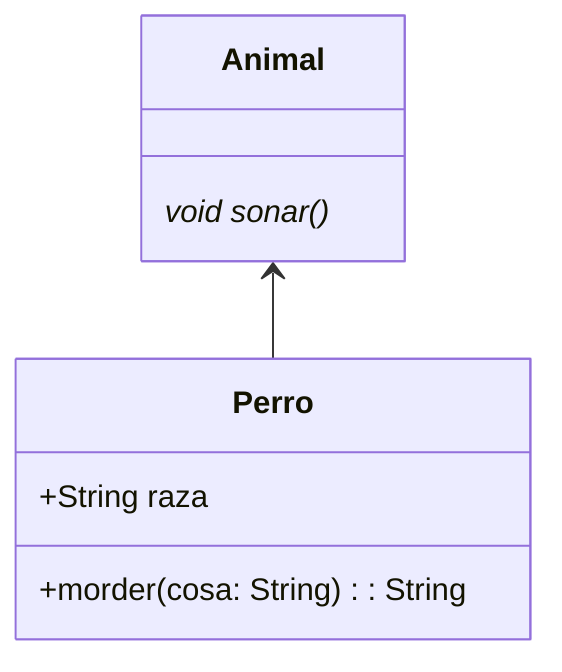

/*# Diagrama de classes

## Animales

El siguiente diagrama representa la estructura de clases de Animales

```java
class Perro extends Animal{
  String raza;
  
  String morder(String cosa){
  
  @Override
  void(){
  
  }
  }
  
  abstract class Animal{
  void alimentar(){
   }
   abstract 
  }
}
```



*/
